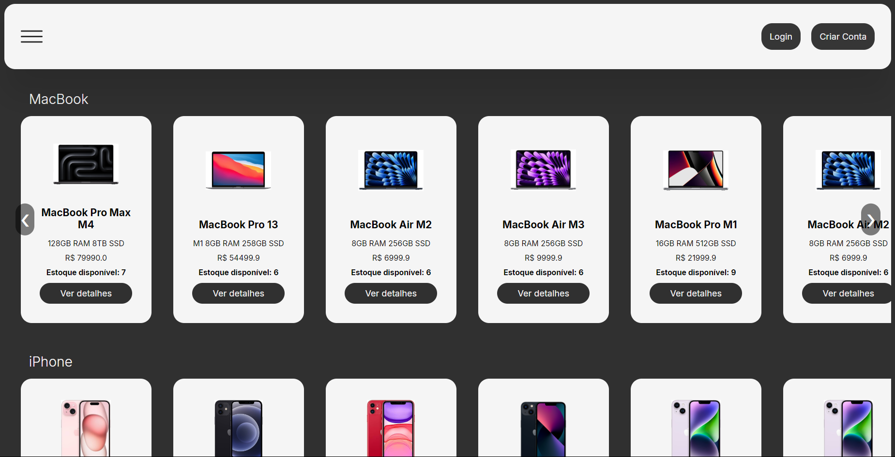
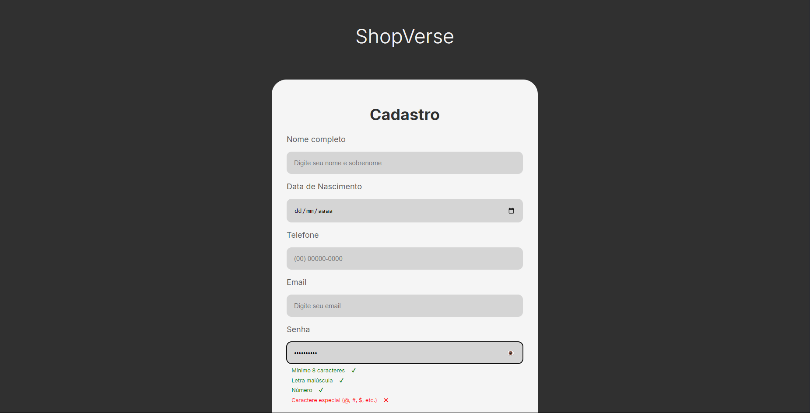
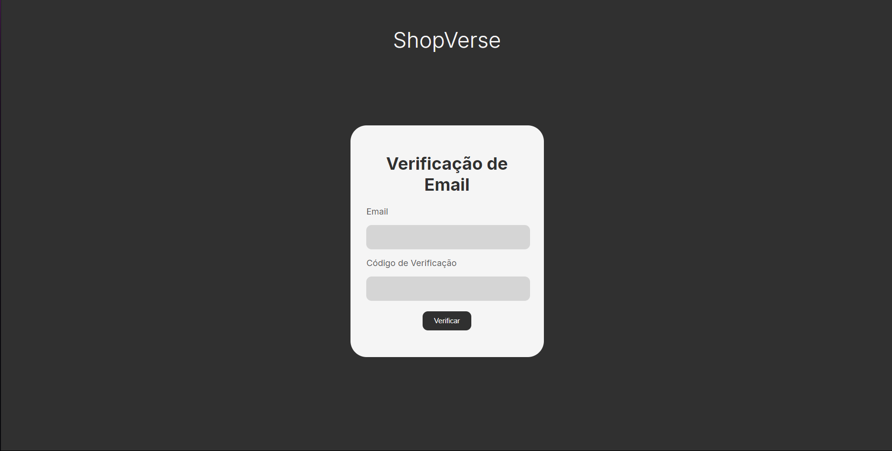
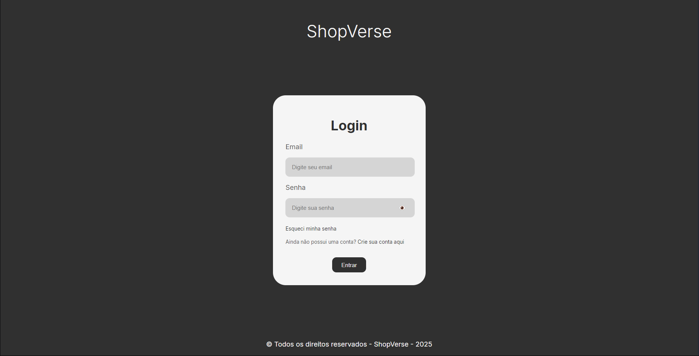
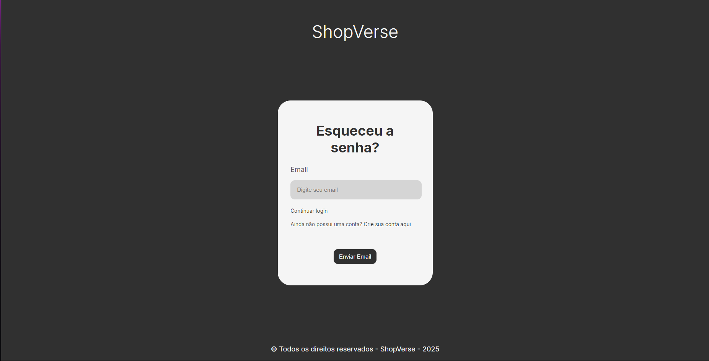
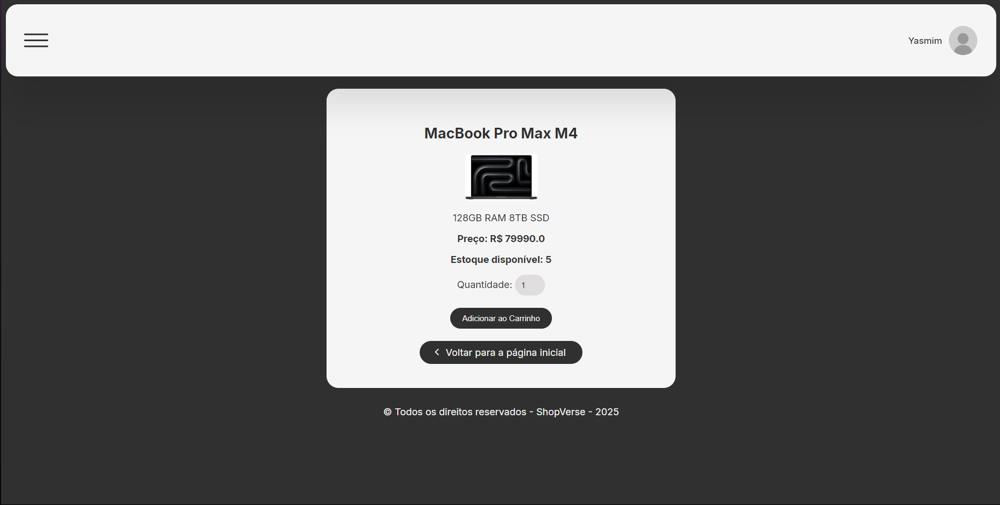
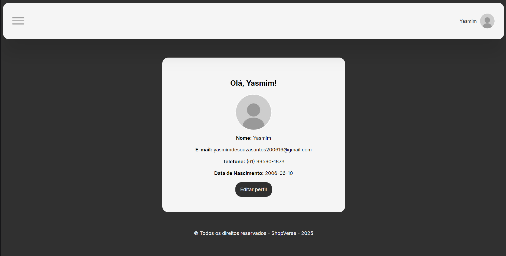
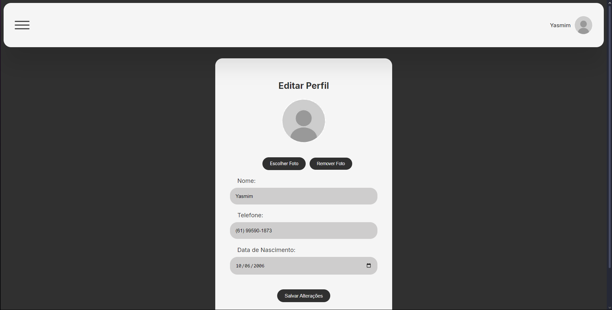
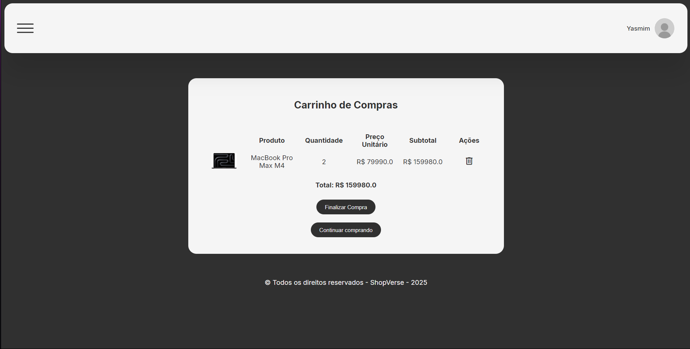
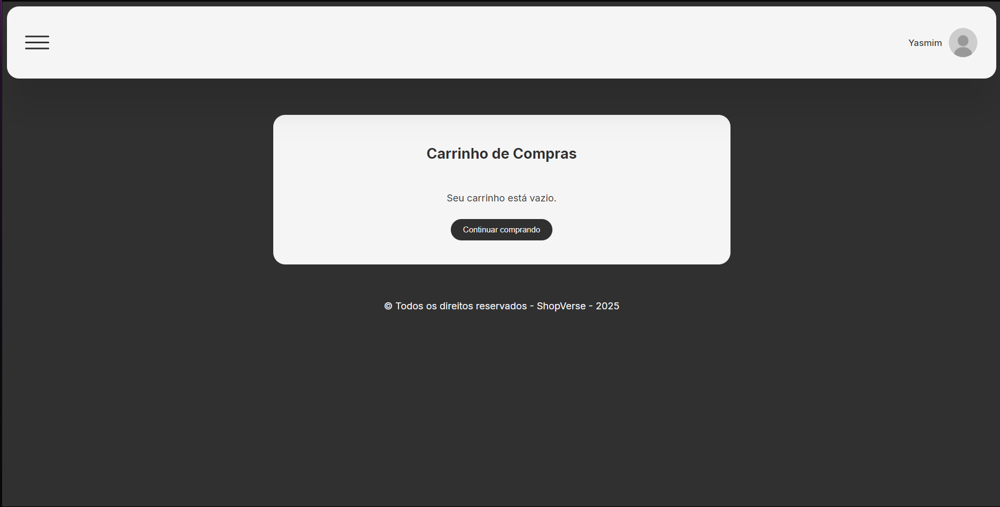

# ShopVerse - E-commerce utilizando o framework Bottle
Projeto de um e-commerce utilizando framework bottle e orientação a objetos.

## 🔨 Funcionalidade
- ShopVerse: E-commerce com página de cadastro, verificação de email para conclusão de cadastro, login, recuperação de senha, página de perfil, edição de perfil, carrinho de compras, finalização de compra e páginas próprias dos produtos.

<br>
<div display: inline_block align="center">
  
  
  
  
  
  
  
  
  
  
</div>

## Acesso ao projeto
Você pode [acessar o código-fonte do projeto](https://github.com/eii-yahs/ShopVerse---E-commerce-utilizando-o-framework-Bottle.git) ou [baixá-lo](https://github.com/eii-yahs/ShopVerse---E-commerce-utilizando-o-framework-Bottle/archive/refs/heads/main.zip).

## 💻 Tecnologias utilizadas
* `Python - 3.13.1`
* `Bottle`
* `Socket.io`
* `Evenlet`
* `werkzeug`
*  `Webtest`
* `Pytest`

## Abrir e rodar o projeto
Na pasta do projeto abra um terminal e execute:

```bash
pip install bottle
pip install python-socketio
pip install werkzeug
pip install eventlet
python route.py
```
*Observação: para utilizar o serviço de envio de email, vá na pasta controllers > email_service.py. Dentro da classe EmailService, no SENDER_EMAIL=" `coloque aqui seu email` " e em SENDER_PASSWORD=" `coloque aqui sua senha de app do seu email` ". Para criar uma senha de app no gmail, pesquise "senhas de app gmail" e crie a sua no email que você utilizará.* <br><br>
Agora o projeto está pronto para ser utilizado.

## Rodar o teste
Ainda na pasta do projeto abra um terminal e execute:

```bash
pip install bottle
pip install python-socketio
pip install werkzeug
pip install eventlet
pip install pytest
pip install webtest
pytest test_app.py
```
